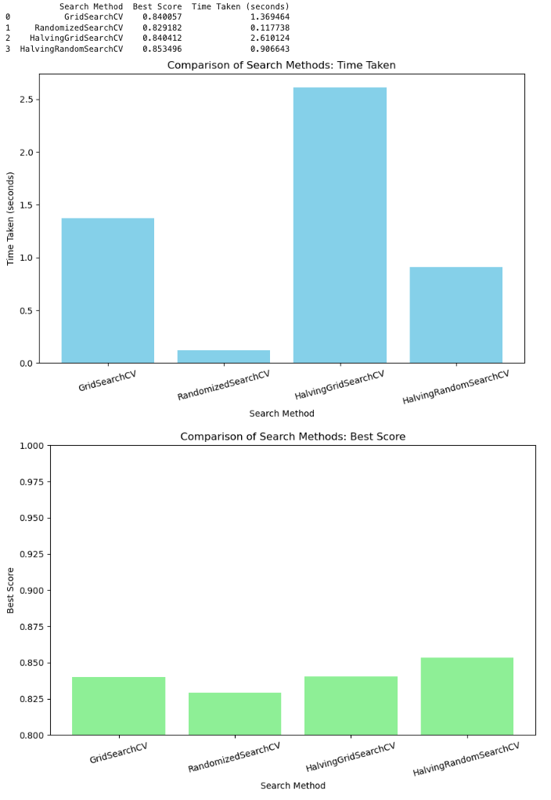

# Hyperparameter Tuning with DecisionTreeClassifier

This repository contains code for performing hyperparameter tuning on a `DecisionTreeClassifier` using different search strategies available in scikit-learn, including `GridSearchCV`, `RandomizedSearchCV`, `HalvingGridSearchCV`, and `HalvingRandomSearchCV`. The goal is to compare these methods in terms of time taken and the accuracy of the resulting models.

## Overview
This project demonstrates how to use different hyperparameter search strategies to tune a `DecisionTreeClassifier`. The methods are compared based on the time they take to run and the accuracy (best score) they achieve. The code also visualizes the results to highlight the trade-offs between these methods.

## Dependencies
- Python 3.x
- pandas
- scikit-learn
- matplotlib

## Methods

The code compares the following hyperparameter tuning methods:

- **GridSearchCV**: An exhaustive search over the parameter grid, testing every possible combination.
- **RandomizedSearchCV**: A random search over a subset of the parameter grid, trading thoroughness for speed.
- **HalvingGridSearchCV**: An iterative version of GridSearchCV that progressively reduces the number of candidates, focusing resources on the most promising options.
- **HalvingRandomSearchCV**: Similar to HalvingGridSearchCV, but with random sampling of the parameter space, further improving speed.

## Results
After running the script, you will see two visualizations:

-  Time Taken by Each Search Method: A bar chart showing the time each method took to complete the search.
-  Best Scores Achieved by Each Search Method: A bar chart comparing the best accuracy scores found by each method.

These results help you understand the trade-offs between exhaustive searches and faster, less thorough methods.

## Conclusion

### GridSearchCV:

- Time Taken: Approximately 1.37 seconds, which is moderate among the methods.
- Best Score: Achieved a score of 0.840, indicating a good performance, though not the highest in this comparison.
- Summary: GridSearchCV provides a balanced approach, offering a decent accuracy with a reasonable time investment. However, it's not necessarily the best in either dimension compared to the other methods.

### RandomizedSearchCV:

- Time Taken: The fastest method, completing in about 0.12 seconds.
- Best Score: Achieved a score of 0.829, slightly lower than GridSearchCV.
- Summary: RandomizedSearchCV excels in speed, making it the best choice when time is of the essence. However, it comes with a slight trade-off in accuracy.

### HalvingGridSearchCV:

- Time Taken: The slowest method, taking around 2.61 seconds.
- Best Score: Scored 0.844, the highest accuracy among the methods tested.
- Summary: HalvingGridSearchCV offers the highest accuracy but at the cost of time. It is ideal when maximum accuracy is desired, and more time can be allocated to the search process.

### HalvingRandomSearchCV:

- Time Taken: Completed in 0.91 seconds, faster than GridSearchCV but slower than RandomizedSearchCV.
- Best Score: Achieved a score of 0.853, the second-highest in this comparison.
- Summary: HalvingRandomSearchCV strikes a good balance between speed and accuracy, outperforming GridSearchCV in both aspects. It’s an excellent choice when you need good accuracy but want to save on computational time.

## Overall Recommendation:

- For Best Accuracy: HalvingGridSearchCV is the best option, despite being the slowest. It found the highest accuracy score among all the methods.
- For Speed: RandomizedSearchCV is the quickest method, though it sacrifices a bit of accuracy compared to other methods.
- For Balanced Performance: HalvingRandomSearchCV provides a good compromise between speed and accuracy, making it a strong candidate for many scenarios where both factors are important.

